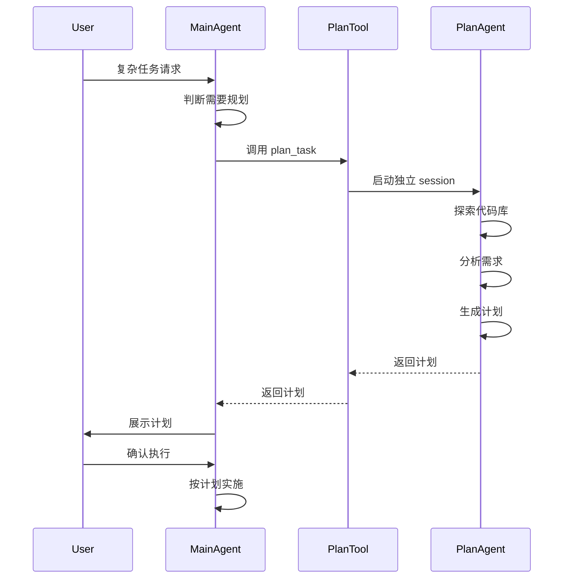

# Plan 模式使用指南

## 概述

Plan 模式通过独立的 Plan Agent 来规划复杂任务，确保在执行前有清晰的实施方案。

## 架构设计

```
用户请求
    ↓
主 Agent 判断任务复杂度
    ↓
调用 plan_task 工具
    ↓
独立 Plan Agent 启动
    ├─ 探索代码库 (read, grep, find)
    ├─ 分析需求
    └─ 生成结构化计划
    ↓
返回计划给主 Agent
    ↓
展示给用户确认
    ↓
用户确认后执行
```

## 何时触发 Plan 模式

主 Agent 会在以下场景自动调用 `plan_task` 工具：

1. **多文件修改** - 需要修改 3 个以上文件
2. **架构重构** - 涉及目录结构或架构调整
3. **复杂功能** - 需要探索代码库才能确定方案
4. **不确定性高** - 有多种实现方式可选

## 使用示例

### 示例 1: 添加新功能

```
用户: 添加用户认证功能

主 Agent: 这是一个复杂任务，让我先规划一下...
[调用 plan_task 工具]

Plan Agent 输出:
# 任务规划

## 📋 任务概述
添加基于 JWT 的用户认证功能

## 🔍 现状分析
- 当前项目使用 Express + TypeScript
- 已有用户模型但无认证机制
- 需要保护的 API 路由: /api/user/*

## 📐 实现方案
使用 JWT + bcrypt 实现认证

## 📝 执行步骤
1. 安装依赖: jsonwebtoken, bcrypt
2. 创建 src/middleware/auth.ts
3. 创建 src/services/auth-service.ts
4. 修改 src/api/user-routes.ts 添加认证中间件
5. 添加登录/注册接口

## ⚠️ 风险和注意事项
- 密码需要加盐哈希存储
- JWT secret 需要环境变量配置
- 需要处理 token 过期

## ✅ 验收标准
- 用户可以注册和登录
- 受保护的路由需要 token
- 密码安全存储

主 Agent: 计划已生成，是否开始执行？

用户: 确认

主 Agent: [按计划执行...]
```

### 示例 2: 手动触发

如果主 Agent 没有自动触发，你也可以明确要求：

```
用户: 请先规划一下如何重构数据库层

主 Agent: [调用 plan_task 工具]
```

## Plan Agent 的特点

### 只读操作
Plan Agent 只使用只读工具：
- ✅ read - 读取文件
- ✅ grep - 搜索代码
- ✅ find - 查找文件
- ✅ ls - 列出目录
- ❌ write - 不写入文件
- ❌ edit - 不修改文件
- ❌ bash - 不执行命令

### 独立会话
- Plan Agent 有独立的 session
- 不污染主 Agent 的消息历史
- 规划完成后自动销毁

### 结构化输出
Plan Agent 输出固定格式的计划：
- 任务概述
- 现状分析
- 实现方案
- 执行步骤
- 风险评估
- 验收标准

## 工作流程



## 配置

Plan 模式已集成到主 Agent，无需额外配置。

相关文件：
- `src/infrastructure/tools/plan-tool.ts` - Plan 工具定义
- `src/services/plan/plan-agent.ts` - Plan Agent 实现
- `src/config/config.ts` - System prompt 配置

## 最佳实践

1. **信任 Agent 判断** - 主 Agent 会自动判断何时需要规划
2. **提供上下文** - 描述任务时提供足够的背景信息
3. **审查计划** - 仔细检查生成的计划，确认后再执行
4. **迭代优化** - 如果计划不满意，可以要求重新规划

## 与其他模式对比

| 模式 | 适用场景 | 优点 | 缺点 |
|------|---------|------|------|
| **Plan 模式** | 复杂任务 | 规划清晰、风险可控 | 多一轮交互 |
| **直接执行** | 简单任务 | 快速响应 | 可能走弯路 |
| **Skill 模式** | 固定流程 | 标准化 | 灵活性低 |

## 故障排查

### Plan Agent 启动失败
- 检查 DeepSeek API 配置
- 查看 `.env` 文件中的 API key

### 计划质量不佳
- 提供更详细的任务描述
- 添加上下文信息（相关文件路径等）

### 主 Agent 未自动触发
- 明确说明任务的复杂性
- 或直接要求："请先规划一下"
